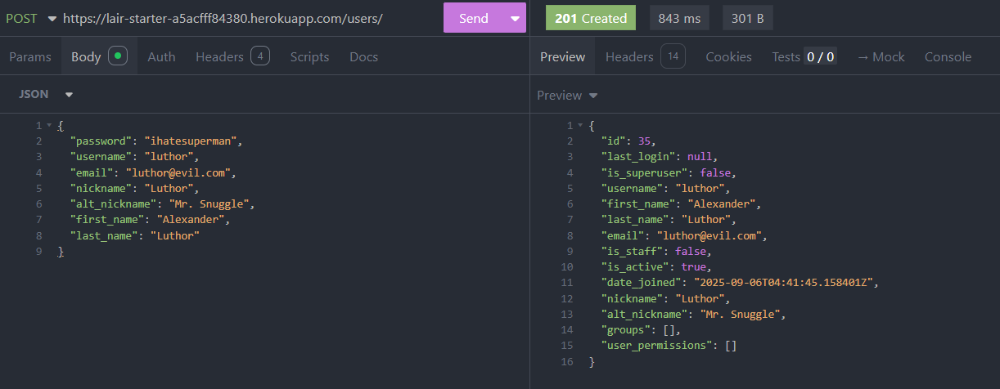
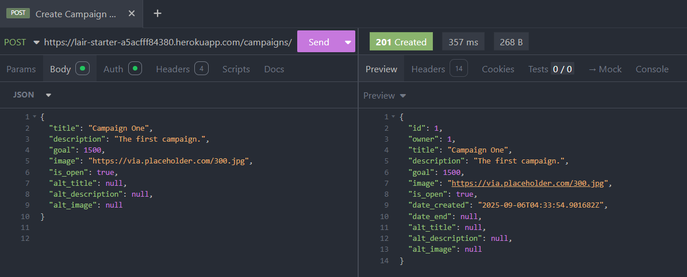
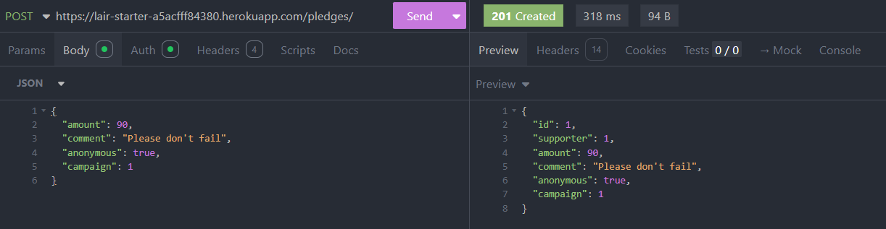
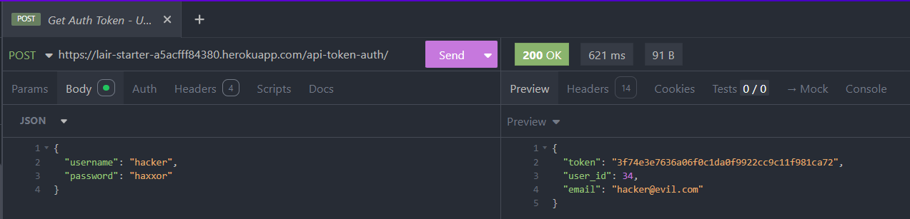
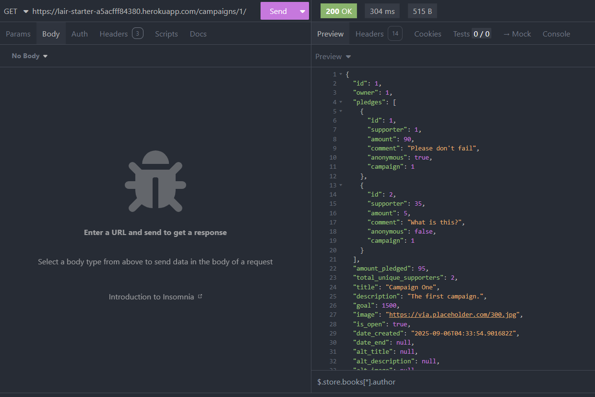

# Crowdfunding Back End
Sheila S.

## Planning:
### Concept/Name
Crowdfunding for villain lair - Name to be determined.

### Heroku URL
https://lair-starter-a5acfff84380.herokuapp.com/

### Intended Audience/User Stories
- Evil henchman who would like to fund a new/established villain lair, or who'd like to simply support their favourite villain.
- Villains with aspirations to be a supervillain. After all, you can't be considered a supervillain if don't have your own deadly lair.  

### Front End Pages/Functionality
- Home page
    - Featured campaigns
    - Most popular campaign (based off amount pledged)
- Create new campaigns
    - Form containing campaign details
    - Ability to submit
    - Nice error pages for validation
- Display campaign
    - Display campaign details
    - Display total amount pledged out of target total
    - Display comments from pledges with names/anonymous
    - Display a default message if there is no pledge
    - Nice error pages for validation
- Pledges
    - List all pledges made by the user with links to campaigns
    - Ability to add pledge for a campaign, for logged in user
    - User is able to pledge multiple times for the same campaign
    - Form containing pledge details (amount, comment, anonymity)
    - Nice error pages for validation for amount and ensuring that pledges are made only for active campaigns
- Logon
    - Form for username and password
    - Error message for validation
- Signup
    - Ability to create new user
    - Error message/page for duplicate usernames or duplicate email
- User page
    - Display username
    - Link to view pledges made by the user, with placeholder if no pledges
    - List campaigns created by the user, with placeholder if no campaigns
    - Ability to logoff
    - Ability to edit username/email/password is not supported
    - Ability to update pledge (changing pledge amount etc) is currently enabled 
- Stretch goals [PLANNED]
    - List all stretch goals for selected campaign
    - Ability to add stretch goal for selected campaign, for owner of the campaign
    - Form containing stretch goal details (amount, description)
    - Nice error pages for validation for amount and ensuring that stretch goals are made only for active campaigns
- Admin page [PLANNED]
    - List all campaigns
    - Ability to edit campaign details
    - Ability to delete campaign
    - Ability to delete user
    - Ability to add stretch goal for selected campaign

### API Spec
API endpoints (note that included are endpoints for stretch goals, which are not implemented yet):

| URL           | HTTP Method | Purpose                                       | Request Body | Success Response Code | Authentication/Authorisation          |
|---------------|-------------|-----------------------------------------------|--------------|-----------------------|---------------------------------------|
| /campaigns    | GET         | List all campaigns                            | N/A          | 200                   | None                                  |
| /campaigns    | POST        | Create new campaigns                          | JSON Payload | 201                   | Any logged in user                    |
| /campaigns/1  | POST        | Get the details of selected campaign          | JSON Payload | 201                   | Any logged in user                    |
| /campaigns/1  | PUT        | Update details of selected campaign          | JSON Payload | 200                   | Only owner of the campaign            |
| /pledges/     | GET         | Fetch all pledges                             | N/A          | 200                   | Any logged in user                    |
| /pledges/ | POST        | Create new pledge                             | JSON Payload | 201                   | Any logged in user                    | 
| /pledges/1 | PUT        | Update details of selected pledge                             | JSON Payload | 200                   | Only supporter who created the pledge | 
| /user/        | GET         | View user details                             | N/A          | 200                   | Any logged in user                    |
| /user/        | POST         | Add new user                             | JSON Payload          | 201                   | None                                  |
| /api-token-auth/        | POST         | Get auth token                             | JSON Payload          | 200                   | Any user user with valid credentials  |
| /stretches/1 (not implemented)   | GET         | View all stretch goals for selected campaign  | JSON Payload | 201                   | None                                  |
| /stretches/1 (not implemented)  | POST        | Create new stretch goal for selected campaign | JSON Payload | 201                   | Only owner of the campaign            |

#### Creating a new user
To create a new user, you need to send a POST request to the /users/ endpoint with a JSON payload containing the following mandatory fields:
* username
* email
* password
The rest of the fields are optional.

#### Creating a new campaign
To create a new campaign, you must be logged in and send a POST request to the /campaigns/ endpoint with a JSON payload containing the following mandatory fields:
* title
* description
* goal
* image (URL)
* is_open
The rest of the fields are optional.

#### Creating a new pledge

#### Getting an auth token

#### Getting campaign details

### DB Schema

### Wouldn't it be cool if...

Below are ideas that seemed cool at the time, but abandoned due to complexity or time constraints.

- Campaign to have date created, date started and date ended, which would enable campaigns to be scheduled and to have its status automatically updated. But this would need an automated job to be running in the background, continuously checking for dates and updating the campaign status... too big of a scope for now.
- Related to the above, a campaign could have 1 of 4 possible statuses: DRAFT/ACTIVE/COMPLETED/CANCELLED - however this relates to the automatic status update in the point above.
- 